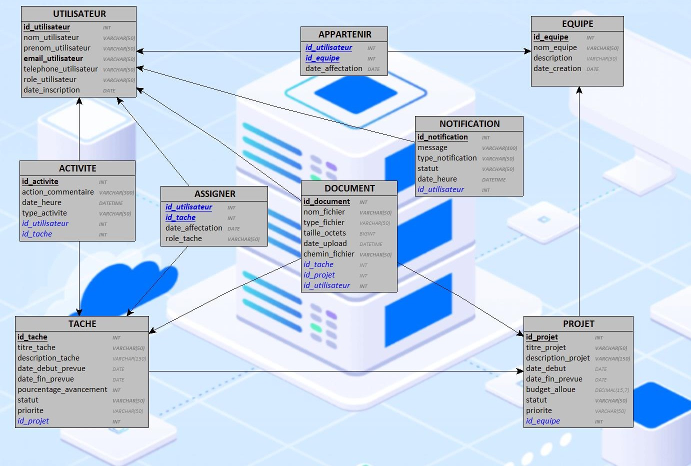

## Modèle Logique de Données (MLD)

Le **MLD (Modèle Logique de Données)** est la **traduction relationnelle** du MCD : on transforme les entités/associations en **tables**, on fixe les **clés primaires (PK)**, les **clés étrangères (FK)**, et on crée les **tables d’association** pour les relations N–N (ex. `ASSIGNER` pour “utilisateur ↔ tâche”). Le MLD explique donc *comment* le modèle métier se mappe dans une base relationnelle, mais reste encore relativement indépendant d’un SGBD particulier.

### Schéma du MLD

### MLD sous forme textuelle

