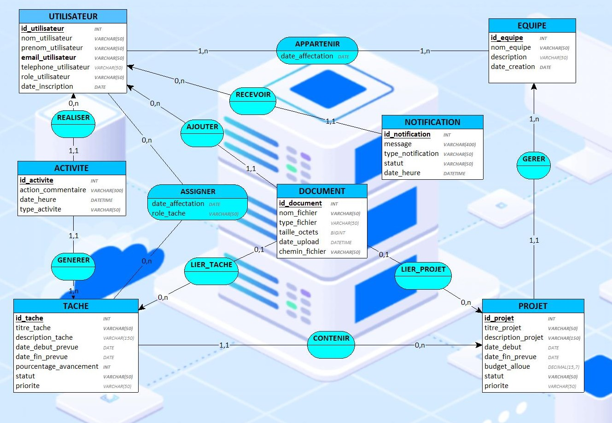

# Modèle Conceptuel de Données (MCD)

Le **MCD (Modèle Conceptuel de Données)** est la représentation **métier** du système : il décrit *ce qu’on veut gérer* (entités comme Utilisateur, Projet, Tâche, Document…) et *comment ces éléments sont liés* (associations) avec leurs **cardinalités** (1..N, 0..N, etc.). À ce stade, on ne parle pas de SQL : l’objectif est de valider que le modèle colle à la réalité du besoin.

L'image suivante présente notre MCD dans le cadre de ce projet.

