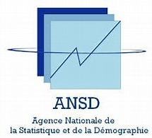

<!-- Centrer les logos et le texte -->

<!-- Logos -->
  
<i>Ministère de l'Economie du Plan et de la Coopération</i>  
  
<i>Agence nationale de la Statistique et de la Démographie (ANSD)</i>  
  
<i>Ecole nationale de la Statistique et de l'Analyse économique Pierre Ndiaye (ENSAE)</i>  
  

<!-- Titre du projet -->

Base de données 1

Bookdown : Logiciel de Gestion de Projets

  

<!-- Informations sur les rédacteurs -->

<i>Rédigé par :</i>  
<b>Dior Mbengue, Kenrencia Dyvana Seunkam Pahane et</b> <b>Khadidiatou Coulibaly</b>  
<i>Élèves ingénieurs Statisticiens économistes</i>

 

<!-- Superviseur -->

<i>Sous la supervision de :</i>  
<b>M. Baye Demba DIACK</b>  
<i>Administrateur de bases de données</i>

 

<!-- Année scolaire -->

Année scolaire : 2025/2026

<!----------------------------------FIN DE SCRIPT - Page de garde ---------------------------------------->

